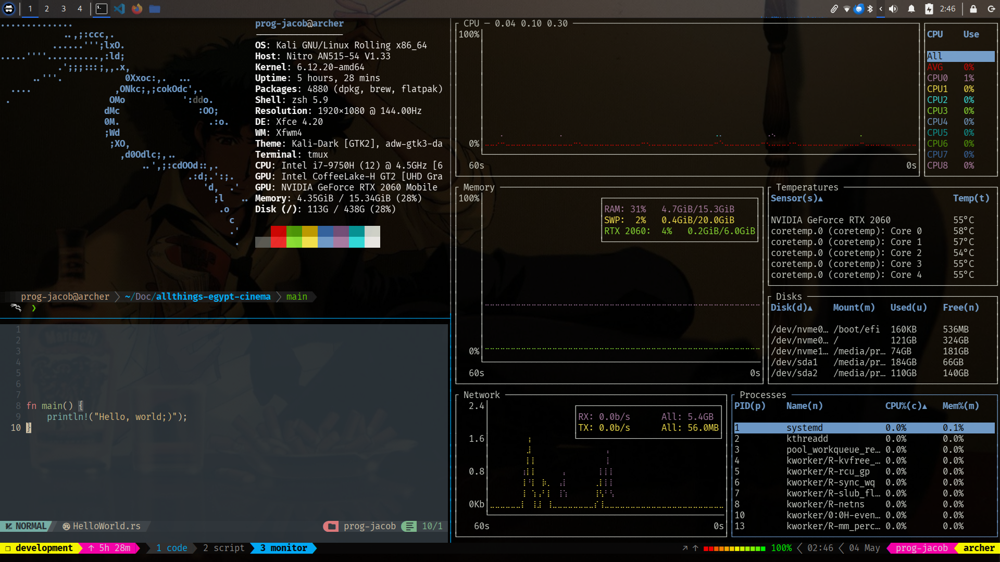
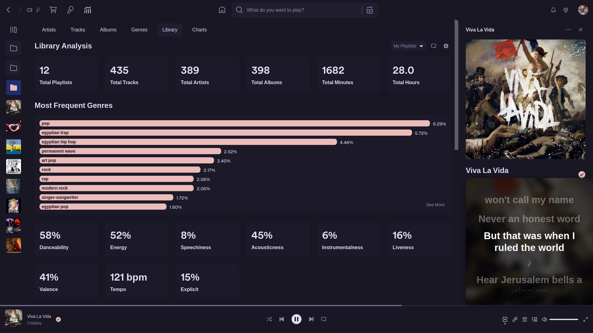
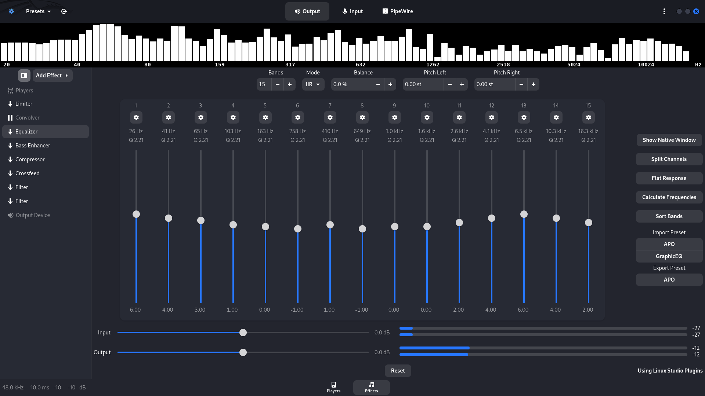
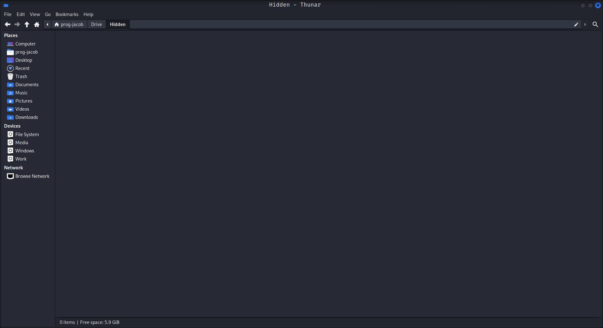
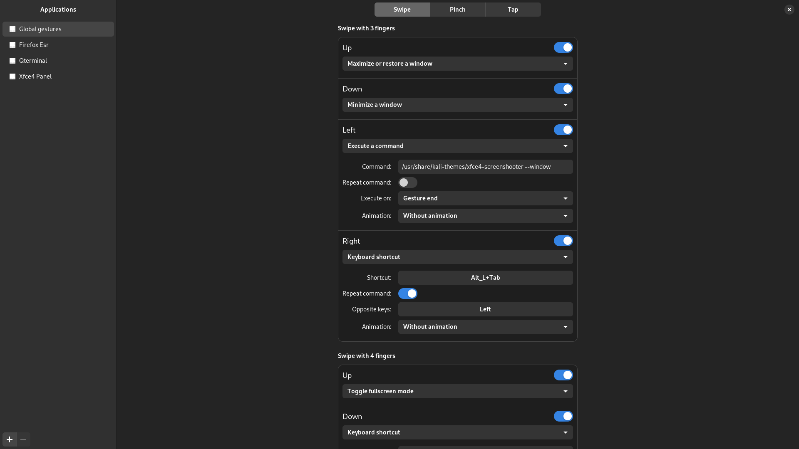

# My Dotfiles

This is my personal setup for Linux systems — mainly as a backup and to easily reproduce my development environment. It uses [DotBot](https://github.com/anishathalye/dotbot) to manage symlinks and setup steps, and [`git-crypt`](https://github.com/AGWA/git-crypt) to securely store private configuration.

> I lost my system twice during this process. Thankfully, I was able to recover everything important from a live USB using [`PhotoRec`](https://www.cgsecurity.org/wiki/PhotoRec).

## What’s Included

- Terminal: [QTerminal](https://github.com/lxqt/qterminal) + [Zsh](https://www.zsh.org/) + [Oh My Zsh](https://ohmyz.sh/) + [Powerlevel10k](https://github.com/romkatv/powerlevel10k)
- [Tmux](https://github.com/tmux/tmux) with [Oh My Tmux](https://github.com/gpakosz/.tmux)
- [Neovim](https://neovim.io/) with [NvChad](https://nvchad.com/)
- [Neofetch](https://github.com/dylanaraps/neofetch)
- [Touchégg](https://github.com/JoseExposito/touchegg) via [Touche](https://github.com/JoseExposito/touche) for touchpad gestures
- [EasyEffects](https://github.com/wwmm/easyeffects) presets for audio processing
- Git configuration
- [Rclone](https://rclone.org/) setup for Google Drive sync
- XFCE-specific keybindings and desktop tweaks

## Terminal Layout



## Spicetify Layout



## EasyEffects Layout



## Google Drive Layout

Google Drive is as normal as any other local folder.



## Touchpad Gestures



## Cloning

```bash
git clone --recursive https://github.com/Prog-Jacob/dotconfig ~/.dotfiles
cd ~/.dotfiles
git-crypt unlock
./install
```

You'll need GPG access to unlock private files encrypted with `git-crypt`.
